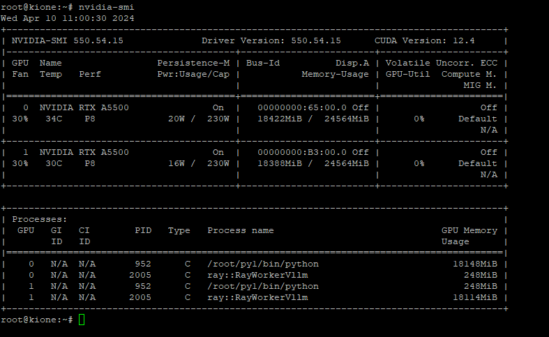

# Backend
## Vorbereitung
Install CUDA driver
```
apt update
apt install vim curl locate nmap git git-lfs -y
apt-get install linux-headers-$(uname -r)
apt update
apt install build-essential
gcc --version
add-apt-repository contrib
apt install software-properties-common
apt update
add-apt-repository contrib
wget https://developer.download.nvidia.com/compute/cuda/repos/debian12/x86_64/cuda-keyring_1.1-1_all.deb
dpkg -i cuda-keyring_1.1-1_all.deb
apt update
apt  -y install cuda

```
Istall Python pip and venv if not installed
```
apt update
apt install python3-pip
apt install python3-venv
```
Create a new python virtual environment
```
python3 -m venv py1
cd py1
bin/pip install vllm
```

In our example the vllm model is in the location: /opt/models/casperhansen/mixtral-instruct-awq

run vllm
> ./bin/python -m vllm.entrypoints.openai.api_server --model /opt/models/casperhansen/mixtral-instruct-awq
or
> ./bin/python -m vllm.entrypoints.openai.api_server --model /opt/models/casperhansen/mixtral-instruct-awq --tensor-parallel-size 2
if you have 2 GPU cards installed

